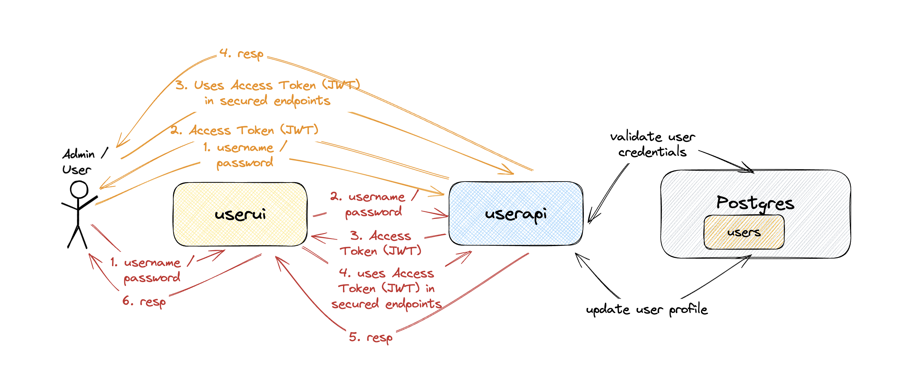

# springboot-react-jwt-token

The goal of this project is to implement an application called `order-app` to manage orders. For it, we will implement a back-end [`Spring Boot`](https://docs.spring.io/spring-boot/index.html) application called `order-api` and a font-end [React](https://react.dev/) application called `order-ui`. Besides, we will use [`JWT Authentication`](https://en.wikipedia.org/wiki/JSON_Web_Token) to secure both applications.

## Proof-of-Concepts & Articles

On [ivangfr.github.io](https://ivangfr.github.io), I have compiled my Proof-of-Concepts (PoCs) and articles. You can easily search for the technology you are interested in by using the filter. Who knows, perhaps I have already implemented a PoC or written an article about what you are looking for.

## Additional Readings

- \[**Medium**\] [**Implementing A Full Stack Web App Using Spring-Boot and React**](https://medium.com/@ivangfr/implementing-a-full-stack-web-app-using-spring-boot-and-react-7db598df4452)
- \[**Medium**\] [**Implementing Social Login in a Spring Boot and React App**](https://medium.com/@ivangfr/implementing-social-login-in-a-spring-boot-and-react-app-6ce073c9983c)
- \[**Medium**\] [**Building a Web Chat with Social Login using Spring Boot: Introduction**](https://medium.com/@ivangfr/building-a-web-chat-with-social-login-using-spring-boot-introduction-644702e6be8e)
- \[**Medium**\] [**Building a Single Spring Boot App with Keycloak or Okta as IdP: Introduction**](https://medium.com/@ivangfr/building-a-single-spring-boot-app-with-keycloak-or-okta-as-idp-introduction-2814a4829aed)

## Project Diagram



## Applications

- ### order-api

  `Spring Boot` Web Java backend application that exposes a Rest API to create, retrieve and delete orders. If a user has `ADMIN` role he/she can also retrieve information of other users or delete them.

  The application secured endpoints can just be accessed if a valid JWT access token is provided.

  `order-api` stores its data in [`Postgres`](https://www.postgresql.org/) database.

  `order-api` has the following endpoints:

  | Endpoint                                                      | Secured | Roles           |
  | ------------------------------------------------------------- | ------- | --------------- |
  | `POST /auth/authenticate -d {"username","password"}`          | No      |                 |
  | `POST /auth/signup -d {"username","password","name","email"}` | No      |                 |
  | `GET /public/numberOfUsers`                                   | No      |                 |
  | `GET /api/users/me`                                           | Yes     | `ADMIN`, `USER` |
  | `GET /api/users`                                              | Yes     | `ADMIN`         |
  | `GET /api/users/{username}`                                   | Yes     | `ADMIN`         |
  | `DELETE /api/users/{username}`                                | Yes     | `ADMIN`         |
  | `PUT /api/users/{username}`                                   | Yes     | `ADMIN`, `USER` |

- ### order-ui

  `React` frontend application where a user with role `USER` can create an order and retrieve a specific order. On the other hand, a user with role `ADMIN` as access to all secured endpoints.

  In order to access the application, a `user` or `admin` must login using his/her `username` and `password`. All the requests coming from `order-ui` to secured endpoints in `order-api` have the JWT access token. This token is generated when the `user` or `admin` logins.

  `order-ui` uses [`Semantic UI React`](https://react.semantic-ui.com/) as CSS-styled framework.

## Prerequisites

- [`npm`](https://docs.npmjs.com/downloading-and-installing-node-js-and-npm)
- [`Java 21+`](https://www.oracle.com/java/technologies/downloads/#java21)
- Some containerization tool [`Docker`](https://www.docker.com/), [`Podman`](https://podman.io/), etc.
- [`jq`](https://jqlang.github.io/jq/)

## Start Environment

- In a terminal, make sure you are inside the `springboot-react-jwt-token` root folder;

- Run the following command to start docker compose containers:
  ```
  docker compose up -d
  ```

## Running order-app using Maven & Npm

- **order-api**

  - Open a terminal and navigate to the `springboot-react-jwt-token/order-api` folder;

  - Run the following `Maven` command to start the application:
    ```
    ./mvnw clean spring-boot:run
    ```

- **order-ui**

  - Open another terminal and navigate to the `springboot-react-jwt-token/order-ui` folder;

  - Run the command below if you are running the application for the first time:

    ```
    npm install
    ```

  - Run the `npm` command below to start the application:

  ```
      npm start
  ```

  - Running E2E Tests

    To run the end-to-end (E2E) tests using Cypress, follow these steps:
    Install Cypress: If you haven't already installed Cypress, run the following command in your project root directory:

    ```
    npm install cypress --save-dev
    ```

    Open Cypress: Run the following command to open the Cypress Test Runner:

    ```
    npx cypress open
    ```

    Run Tests: In the Cypress Test Runner, select the test file you want to run. For example, to run the adminPage.cy.js test, navigate to cypress/e2e/admin-role-actions/adminPage.cy.js and click on it.

## Applications URLs

| Application | URL                                   | Credentials                                         |
| ----------- | ------------------------------------- | --------------------------------------------------- |
| order-api   | http://localhost:8080/swagger-ui.html |                                                     |
| order-ui    | http://localhost:3000                 | `admin/admin`, `user/user` or signing up a new user |

> **Note**: the credentials shown in the table are the ones already pre-defined. You can signup new users.

## Demo

- The gif below shows a `user` loging in:

  

- The gif below shows an `admin` loging in:

  

  ## Security and JWT Configuration

  ### Encryption Method

  The project uses `BCryptPasswordEncoder` for password encryption. `BCryptPasswordEncoder` is a password encoder provided by Spring Security that uses the BCrypt strong hashing function to secure passwords.

  ### Security Strategy

  The project uses Spring Security to implement security strategies, including authentication and authorization. Key configurations include:

  - **Authentication**: Uses `AuthenticationManager` and `UsernamePasswordAuthenticationToken` for user authentication.
  - **Authorization**: Configures access permissions for different roles, ensuring that only users with appropriate permissions can access specific endpoints.
  - **Cross-Origin Resource Sharing (CORS)**: Allows requests from `http://localhost:3000`.

  ### JWT Configuration

  The project uses JSON Web Tokens (JWT) for authentication and authorization. JWT configuration includes:

  - **Signing Key**: Uses the `HS512` algorithm and a 32-byte secret key for signing and verifying tokens.
  - **Expiration Time**: JWT expiration time is set to 10 minutes.

  ### Relevant Files

  1. **`TokenProvider` Class**: Responsible for generating and validating JWTs.
  2. **`SecurityConfig` Class**: Configures Spring Security, including the password encoder and authentication manager.
  3. **Configuration File (`application.yml`)**: Contains JWT secret and expiration time configurations.
  4. **`AuthController` Class**: Handles user login and registration requests and uses `TokenProvider` to generate JWTs.

## Util Commands

- **Postgres**

  ```
  docker exec -it postgres psql -U postgres -d userdb
  \dt
  ```

- **jwt.io**

  With [jwt.io](https://jwt.io) you can inform the JWT token and the online tool decodes the token, showing its header and payload.

## Shutdown

- To stop `order-api` and `order-ui`, go to the terminals where they are running and press `Ctrl+C`;

- To stop and remove docker compose containers, network and volumes, go to a terminal and, inside the `springboot-react-jwt-token` root folder, run the command below:
  ```
  docker compose down -v
  ```

## How to upgrade order-ui dependencies to latest version

- In a terminal, make sure you are in the `springboot-react-jwt-token/order-ui` folder;

- Run the following commands:
  ```
  npm upgrade
  npm i -g npm-check-updates
  ncu -u
  npm install
  ```

## References

- https://www.callicoder.com/spring-boot-security-oauth2-social-login-part-2/#jwt-token-provider-authentication-filter-authentication-error-handler-and-userprincipal
- https://bezkoder.com/spring-boot-jwt-authentication/
- https://dev.to/keysh/spring-security-with-jwt-3j76
